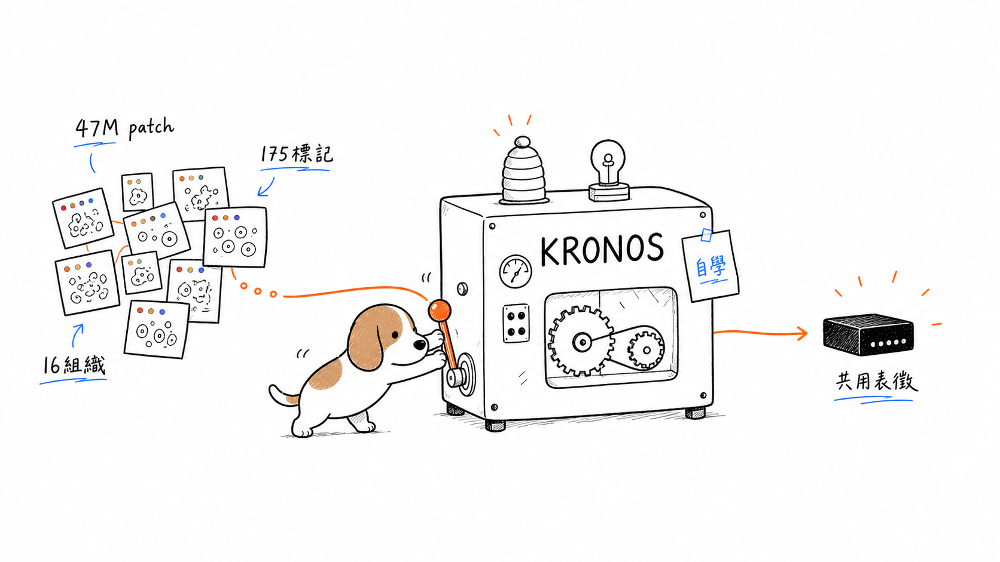
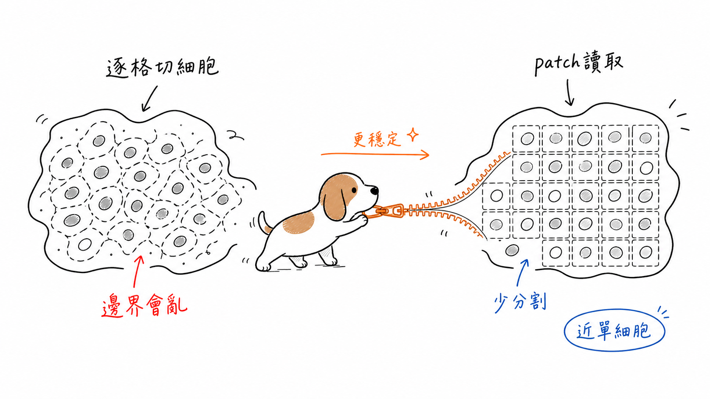
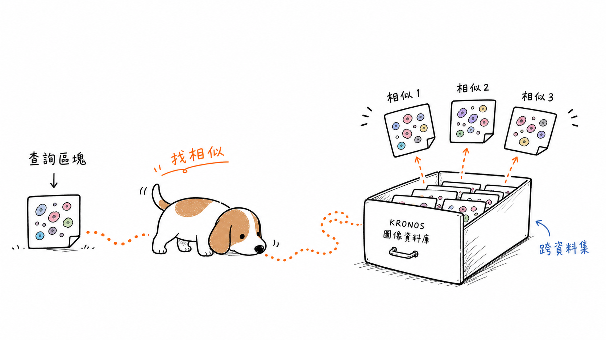
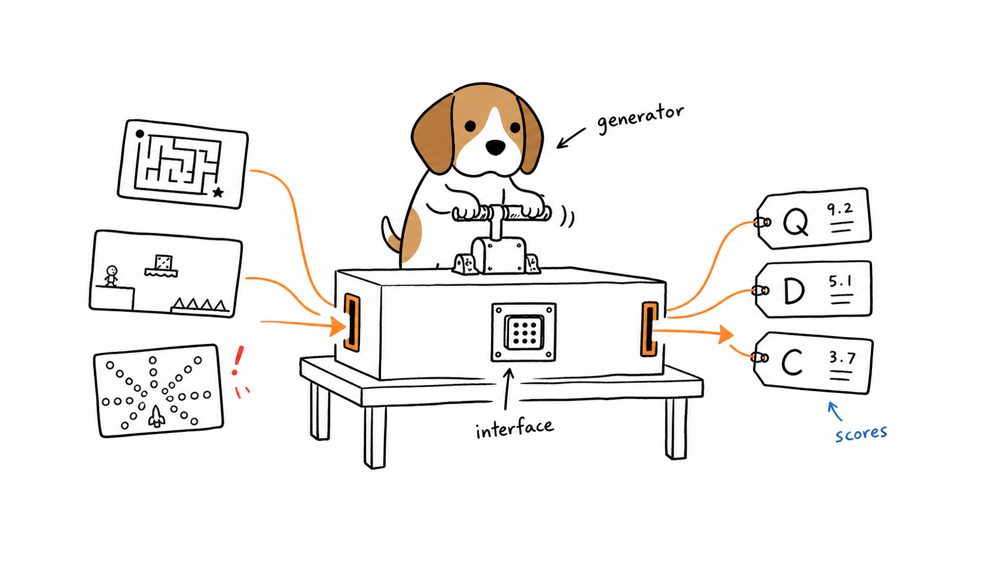
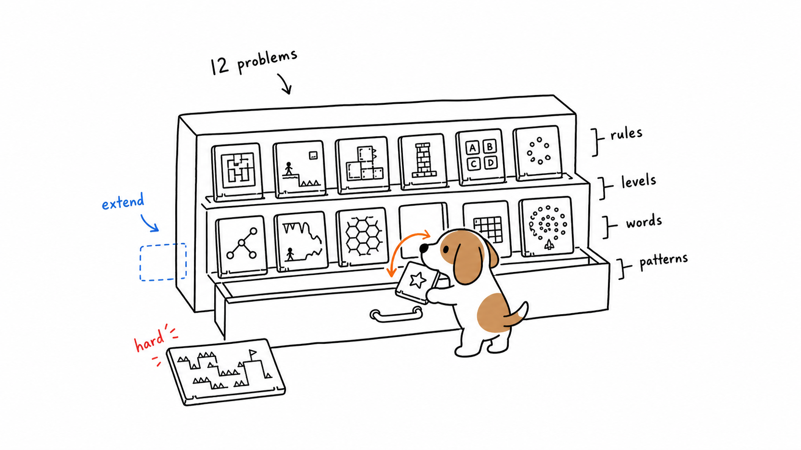
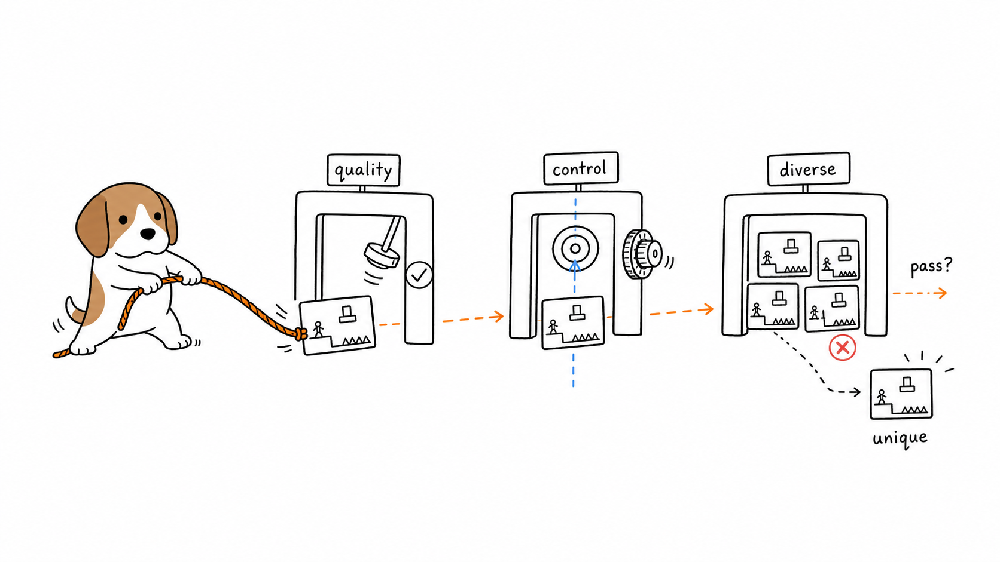
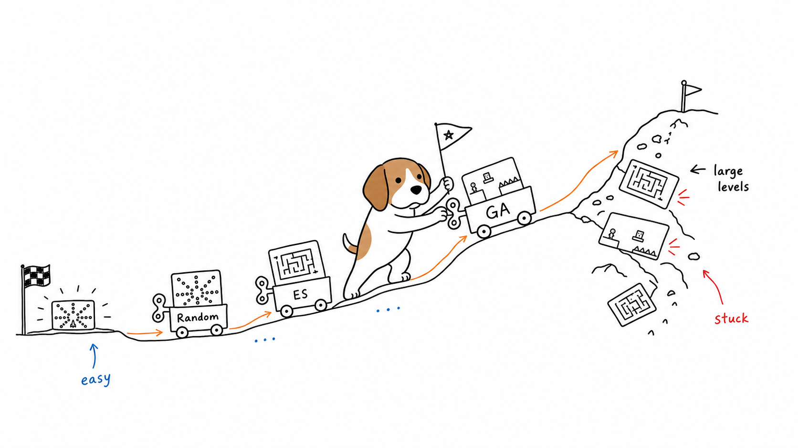

# Doctor Beagle Illustrations

> 繁中/英文文章的米格魯手繪正文配圖生成 Skill。
>
> 16:9 橫版 | 純白手繪 | Doctor Beagle IP | 少量紅橙藍批註 | Codex Skill

---

## What This Is

Doctor Beagle Illustrations is a Codex Skill for turning article ideas, workflows, conceptual structures, and research-paper claims into clean, strange, hand-drawn body illustrations.

It is designed for Traditional Chinese and English writing. The recurring visual IP is **Doctor Beagle**: a compact short-legged beagle with floppy tan ears, tiny black dot eyes, a black oval nose, white muzzle and belly, tan patches, and a serious deadpan working attitude.

The goal is not to make a polished mascot, PPT infographic, or cute pet sticker. The goal is to make one sparse visual metaphor that helps the reader understand a key idea.

---

## Attribution

This project is adapted from:

[Ian Xiaohei Illustrations](https://github.com/helloianneo/ian-xiaohei-illustrations) by Ian / [helloianneo](https://github.com/helloianneo)

The original project is licensed under the MIT License.

This derivative keeps the core article-illustration workflow and sparse hand-drawn visual logic, while changing:

- the recurring character from Xiaohei to Doctor Beagle
- the default language rules to Traditional Chinese / English
- the bundled visual anchors
- the reference prompts and QA rules for beagle character consistency

See [NOTICE.md](NOTICE.md) for attribution details.

---

## Install

Install the skill with an Agent Skills compatible installer:

```bash
npx skills add https://github.com/chaosbeagle/doctor-beagle-illustrations --skill "doctor-beagle-illustrations"
```

Or copy the skill folder manually:

```bash
mkdir -p "${CODEX_HOME:-$HOME/.codex}/skills"
cp -R ./doctor-beagle-illustrations "${CODEX_HOME:-$HOME/.codex}/skills/"
```

Restart Codex after installing.

---

## Usage

### Generate Body Illustrations

```text
Use $doctor-beagle-illustrations to 為這篇文章設計並生成 4 張米格魯手繪正文配圖。

<貼上文章>
```

### Plan a Shot List Only

```text
Use $doctor-beagle-illustrations to 先不要生圖。
請分析這篇文章哪些段落值得配圖，輸出 5 張左右的 shot list。

<貼上文章>
```

### Generate One Concept Image

```text
Use $doctor-beagle-illustrations to 為「少量標註也能跨資料集轉移」生成一張 16:9 正文配圖。
畫面要白底、手繪、少字，Doctor Beagle 必須做核心動作。
```

More prompts: [examples/prompts.md](examples/prompts.md)

---

## English Quick Start

Use English when the source article is English or when the generated image should contain English handwritten labels.

```text
Use $doctor-beagle-illustrations to create 4 sparse hand-drawn body illustrations for this research paper.
Use English handwritten labels only.
Keep Doctor Beagle as the active operator in each visual metaphor, not as a decorative mascot.

<paste paper abstract, notes, or PDF summary>
```

For planning before generation:

```text
Use $doctor-beagle-illustrations to plan an illustration shot list for this article.
Do not generate images yet.
For each proposed image, include placement, core idea, structure type, Doctor Beagle action, visual elements, and short English labels.

<paste article>
```

The skill works well for research papers, product essays, technical explainers, workflows, benchmark descriptions, and conceptual comparisons where one image should explain one core idea.

---

## Visual Style

Default output:

- 16:9 horizontal article illustration
- pure white background
- minimalist black hand-drawn line art
- compact Doctor Beagle as the core action subject
- tan/brown beagle markings only on the character
- sparse red/orange/blue handwritten notes
- lots of empty white space
- one image explains one idea

Avoid:

- PPT infographic
- commercial vector illustration
- realistic dog
- pet sticker / mascot poster
- dense system architecture
- Simplified Chinese unless explicitly requested
- top-left type titles such as "Workflow", "System Map", or "Roadmap"

---

## Character Anchors

The skill includes three Doctor Beagle reference sheets to reduce image drift:

| Asset | Purpose |
| --- | --- |
| `doctor-beagle-illustrations/assets/reference/beagle-model-sheet.png` | body proportions and views |
| `doctor-beagle-illustrations/assets/reference/beagle-action-poses.png` | working poses and action vocabulary |
| `doctor-beagle-illustrations/assets/reference/beagle-detail-sheet.png` | head shape, ears, patch placement, palette |

These are visual anchors for `image_gen`; they should not be copied as final article compositions.

---

## Examples

Generated with Doctor Beagle Illustrations for the paper *A Foundation Model for Spatial Proteomics*:

### KRONOS Pretraining



### Segmentation-Free Patch Reading



### Label-Efficient Transfer


### Spatial Pattern Reverse Search



Generated with Doctor Beagle Illustrations for the paper *The Procedural Content Generation Benchmark: An Open-source Testbed for Generative Challenges in Games*:

### Benchmark Interface

One generator plugs different game-content cards into a shared benchmark interface, then receives quality, diversity, and controllability score tags.



### Twelve Game Problems

The benchmark acts like an expandable drawer of heterogeneous game-generation tasks: rules, levels, word games, structures, and bullet patterns.



### Quality, Control, Diversity

A generated artifact is dragged through three checks: whether it is feasible, whether it matches the control parameter, and whether it is distinct from the population.



### Baseline Results and Hard Problems

Random, ES, and GA baselines climb at different speeds, while large levels and low-locality tasks remain hard.



---

## Repository Structure

```text
.
├── doctor-beagle-illustrations/
│   ├── SKILL.md
│   ├── agents/
│   │   └── openai.yaml
│   ├── assets/
│   │   └── reference/
│   └── references/
├── examples/
│   ├── images/
│   └── prompts.md
├── LICENSE
├── NOTICE.md
└── README.md
```

The installable skill is:

```text
doctor-beagle-illustrations/
```

---

## License

MIT License. See [LICENSE](LICENSE).
